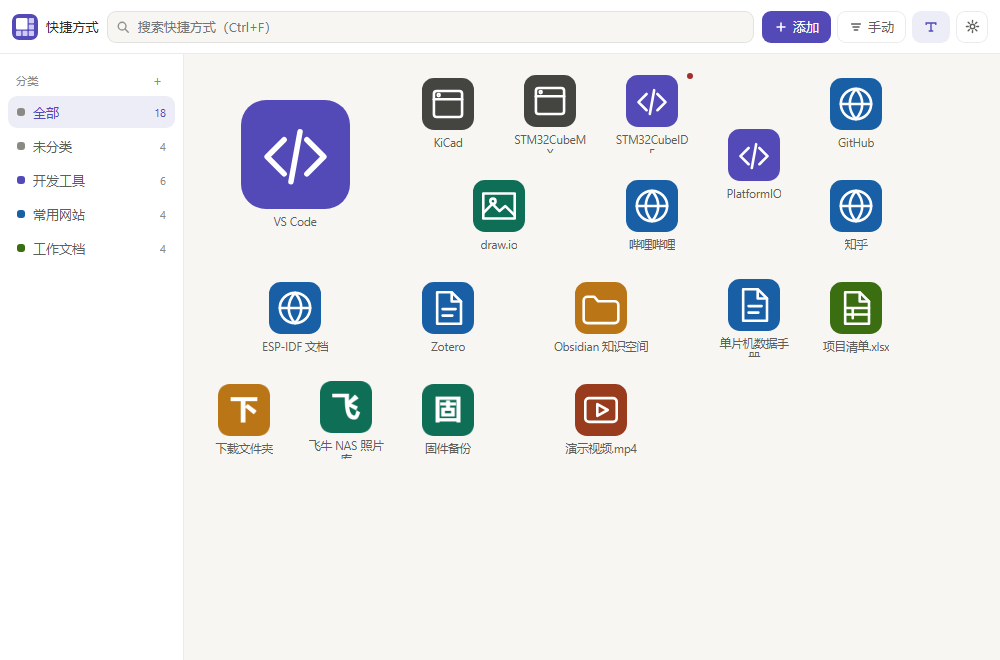

# 快捷方式面板 (Shortcut Launcher)

一个 uTools 插件：把常用的文件、文件夹、网址和本机应用收进一个可分类、可自由调整尺寸的宫格面板，从 uTools 搜索框直达。



## 功能

- **三种添加方式**：把文件 / 文件夹 / 网址直接拖进窗口；手动填写地址；从剪贴板添加。拖入 `.lnk`、`.url` 会自动解析出真实目标。
- **图标自动获取**
  - 本地文件与快捷方式：通过 PowerShell + C# 调用系统 `SHGetImageList(SHIL_JUMBO)` 提取 **256×256 高清位图**（带透明通道）。
  - 网址：自动抓取站点图标（`<link rel=icon>` 按尺寸/类型排序 → 退回 `/favicon.ico` → 可选第三方图标服务）。
  - 手动：文字图标（字符 + 底色 + 字色）、内置字形图标（12 种 + 18 色）、任意图片。
- **侧边栏分类**：新建 / 重命名 / 换色 / 删除；把图标拖到分类上即完成归类，侧边栏显示每个分类的数量。
- **宫格自由布局**：每个图标可占 1×1 ～ 4×4 任意格，右下角拖拽实时缩放；排列顺序支持手动、名称、创建时间、最近使用；显示/隐藏图标文字。
- **一键扫描本机应用**：四个来源勾选扫描 —— 开始菜单快捷方式、系统应用列表（含 UWP，从 AppxManifest 取真实 logo）、桌面快捷方式、已安装程序注册表（App Paths 与 Uninstall 键），带搜索、图标预览、多选批量导入。
- **导入浏览器收藏夹**：支持 Chrome / Edge / Brave / Vivaldi / Chromium / 360 极速 / QQ 浏览器，自动探测多 Profile，文件夹树形三态勾选，导入后后台并发拉取图标。
- **批量操作**：橡皮筋框选（`Ctrl` 追加）/ `Ctrl+A` 多选后统一移动分类、装进文件夹、改尺寸、刷新图标、删除。
- **文件夹 / 大文件夹**：同一个容器的两种形态 —— 1×1 是小文件夹（点开弹层操作），调大成 m×n 就变成大文件夹（内部图标平铺、可直接点击）。文件夹可重命名、设背景色；图标可拖入 / 拖出；大文件夹内支持**滚轮滚动**浏览，点标题栏可打开弹层看全。
- **外观**：图标格子大小 / 圆角 / 侧边栏宽度 / 图标文字开关均可调；图标格子支持**背景色（含不透明度调节）**与**描边（颜色 + 粗细）**；文件夹内图标大小可选 小 / 中 / 大 / 与主格一致。
- **其他**：全局搜索（`Ctrl+F`，打开插件后直接敲键盘即可搜索）、右键菜单、目标丢失检测（红点 + 一键清理）、数据导入/导出、深/浅色跟随 uTools 主题、单击/双击打开、启动参数与工作目录；设置面板从**左下角**弹出，不遮挡图标区。

> 面向用户的完整说明见 **[docs/使用手册.md](docs/使用手册.md)**。

## 安装与调试

本项目**无需构建步骤**（纯原生 JS + 一个 preload 脚本 + 一个 PowerShell 桥），直接用 uTools 开发者模式加载即可。

1. 打开 uTools → 偏好设置 / 开发者工具 → 新建项目。
2. 项目目录指向本仓库根目录（`plugin.json` 所在目录）。
3. 保存后，在 uTools 搜索框输入「快捷方式」即可唤起主面板。

> 浏览器预览：直接双击 `index.html` 打开也能看界面，此时自动进入 `mock` 模式（数据存于 `localStorage`，不触碰真实数据，方便快速预览样式与交互）。控制台执行 `localStorage.removeItem("kl-mock-data")` 可重置示例数据。
>
> 预览调试钩子（URL 参数）：`?dlg=scan|bookmarks|settings|add|edit|icon|folder|confirm` 直接打开对应弹窗；
> `?dlg=menu&x=660&y=120&expand=图标尺寸` 在指定位置打开图标右键菜单并强制展开某个二级菜单
> （无头截图里没法触发 `:hover`，所以用它来验证/出图菜单边界效果）；`?debug` 把主题与计算色写进 `document.title`；`?empty` 渲染空状态。

## 使用说明

| 操作 | 方式 |
|---|---|
| 添加本机文件 / 快捷方式 | 从资源管理器把文件/文件夹/`.lnk` 拖进窗口，或点工具栏「添加」→ 选择文件 |
| 添加网址 | 工具栏「添加」→ 手动新建，粘贴网址；或复制网址后「从剪贴板添加」 |
| 归类 | 选中图标拖到左侧分类；或多选后点工具栏批量移动 |
| 改尺寸 | 右键菜单选尺寸，或拖动图标右下角实时缩放，或在编辑器里调 |
| 编辑图标 / 名称 / 启动参数 | 点图标上的编辑按钮或双击图标的“更多” |
| 扫描本机应用 | 工具栏「添加」→ 扫描本机应用，勾选来源后扫描、搜索、批量导入 |
| 导入收藏夹 | 工具栏「添加」→ 导入浏览器收藏夹，选浏览器与 Profile，树形勾选目录 |

## 技术架构

```
utools-shortcut-launcher/
├── plugin.json            # 入口声明（关键词、features、文件拖入唤起）
├── logo.png               # 插件图标（tools/make-logo.py 生成）
├── index.html             # 主界面外壳
├── preload.js             # uTools preload：暴露 window.services（数据/图标/启动/扫描）
├── css/style.css          # 主题变量 + 宫格与弹窗样式
├── js/
│   ├── store.js           # 数据模型（分类/快捷方式/设置）、持久化、排序、增删改
│   ├── icons.js           # 图标引擎：图像归一化、文字/字形图标、favicon 抓取
│   ├── grid.js            # 宫格视图、拖拽（外部/排序/归类/缩放）、右键菜单
│   ├── dialogs.js         # 编辑器 / 扫描导入 / 收藏夹导入 / 设置面板
│   ├── ui.js              # 通用 UI（弹窗、菜单、进度、Toast）
│   ├── app.js             # 启动流程、工具栏、侧边栏、搜索、主题
│   └── mock.js            # 浏览器预览模式的示例数据与 window.services 桩
├── tools/
│   ├── ps-bridge.ps1      # 常驻 PowerShell 桥：图标提取 / lnk 解析 / 应用扫描
│   ├── release.js         # 生成发布目录 dist/ 并做上架合规检查
│   ├── uitest.html        # UI 回归测试（iframe 加载真实页面，校验菜单边界）
│   ├── dedup-test.html    # 去重回归测试（同一 exe 不同参数不能互相判重）
│   ├── selftest.js        # 桥接层自测（图标/lnk/应用扫描）
│   ├── smoke.js           # 渲染冒烟校验
│   └── make-logo.py       # logo 生成脚本
├── docs/
│   ├── 使用手册.md          # 面向用户的使用说明（发布时提交给 uTools）
│   └── screenshot-*.png    # README 与市场列表用截图
└── dist/                  # 发布目录（由 tools/release.js 生成，已 gitignore）
```

**PowerShell 桥接进程**：`preload.js` 启动一个常驻 `powershell.exe` 子进程，通过 stdin/stdout 单行 JSON 协议通信（进程挂掉时自动降级为一次性调用）。实测：图标提取冷启动约 1.9s（含 C# 编译），热调用约 17–28ms；`.lnk` 解析约 130ms；应用扫描约 2–4s 返回 200–500 项。

## 发布到 uTools 插件应用市场

```bash
node tools/release.js      # 生成 dist/ 并逐项做合规检查
```

脚本会只复制插件真正需要的 12 个文件到 `dist/`，并检查官方 FAQ 里列出的红线
（`.git/`、`.gitignore`、`.vscode/`、`*.map`、`node_modules`）、页面是否有外部静态资源引用、
`preload.js` 是否被压缩或用了 ESM 语法、`ps-bridge.ps1` 是否含非 ASCII 字节、
`plugin.json` 是否残留 `development` 或固定高度字段。

需要注意的几点（都是脚本已经帮你处理好的）：

- **`tools/ps-bridge.ps1` 必须跟着一起发布**。`preload.js` 用
  `path.join(__dirname, 'tools', 'ps-bridge.ps1')` 定位它，目录结构变了图标提取与 `.lnk` 解析会全部失效。
- **`js/mock.js` 不进发布包**，它是浏览器预览用的桩，且内含示例个人路径；脚本会同时从
  `dist/index.html` 里删掉对应的 `<script>` 标签。
- **不要把仓库根目录整个打包**（官方明确要求），用 `dist/` 即可。
- **不要设置 `pluginSetting.height`**，固定高度在不同缩放比的屏幕上会显示异常；本插件用
  `utools.setExpendHeight()` 动态设置。

发布步骤：uTools → 「uTools 开发者工具」→ 新建项目指向 `dist/` → 点「发布」→
填版本说明 / 插件介绍（贴 `docs/使用手册.md` 的内容）/ 上传截图 → 提交审核。

> **关于关键词**：`features[0].cmds` 只保留「快捷方式 / 快捷启动 / 快捷面板」三个中文指令。
> 中文指令 uTools 会自动支持拼音和首字母搜索，额外塞 `launcher`、`shortcut`、`kl` 这类通用英文词
> 容易被判定为「模糊 / 重复名称」。安装时 uTools 会把**第一个关键词**自动固定到超级面板，
> 所以「快捷方式」放在首位。

> **关于联网**：插件只在抓取网站图标时会发起网络请求（且可在设置里配置第三方图标服务模板，留空则
> 只尝试站点自身的图标）。发布版页面本身**不引用任何 http(s) 静态资源**，css / js / 图片全部在包内。

## 已知边界

- **拖拽取路径**依赖 Electron 的 `webUtils`/`File.path`。若运行环境拿不到真实路径，兜底方案：把文件拖到 uTools 搜索框（已在 `plugin.json` 注册 `files` 类型唤起），或用「添加」按钮选择。
- **Firefox 收藏夹**为 `places.sqlite`（需解 sqlite），暂未支持；Chromium 系全支持。
- favicon 走直连抓取，被墙或不提供图标的站点会退回字形图标，可在设置里配置第三方图标服务模板。
- **浏览器 PWA 快捷方式**（Chrome / Edge「将网页安装为应用」生成的，可执行文件是共用的 `chrome_proxy.exe` / `msedge_proxy.exe`）按「程序 + 启动参数」判重，多个 PWA 可以共存。但**应用扫描导入的条目 `target` 存的是 `.lnk` 自身路径**（不是解析后的 exe），所以同一个 PWA 分别用拖拽和扫描各加一次会出现两条 —— 手动删掉一条即可。

## 自测

```bash
# 桥接层自测（需 Windows + PowerShell）
node tools/selftest.js

# 渲染冒烟校验（需 Chrome 可用，检查 DOM 结构）
node tools/smoke.js <dump-dom-输出文件>

# UI 回归测试：用 iframe 加载真实 index.html，在 782×524（模拟 uTools 窄窗口）下
# 校验右键菜单二级菜单的边界处理
chrome --headless=new --allow-file-access-from-files --virtual-time-budget=7000 \
  --dump-dom "file:///<repo>/tools/uitest.html"

# 去重回归测试：同一 exe 不同启动参数（Chrome「安装为应用」的 PWA）不能互相判重
chrome --headless=new --allow-file-access-from-files --virtual-time-budget=8000 \
  --dump-dom "file:///<repo>/tools/dedup-test.html"
```

`tools/uitest.html` 与 `tools/dedup-test.html` 都直接 iframe 引入 `../index.html`，断言结果写在
`document.title` 里，用 `--dump-dom` 回读即可；不复制页面结构，所以页面改了测试不会悄悄失效。
`dedup-test.html` 会临时替换 iframe 里的 `window.services.resolvePaths` 喂假数据，跑完在
in-memory 的 mock 数据里留下几条测试条目 —— 用单独的 `--user-data-dir` 跑即可，别拿它去动真实数据。

> `--allow-file-access-from-files` 不能省：`file://` 下 iframe 与父页属于不同 origin，没有这个参数
> 会直接报 `Blocked a frame with origin "null" from accessing a cross-origin frame`（测试会把这行原话印出来）。

## 许可

MIT
